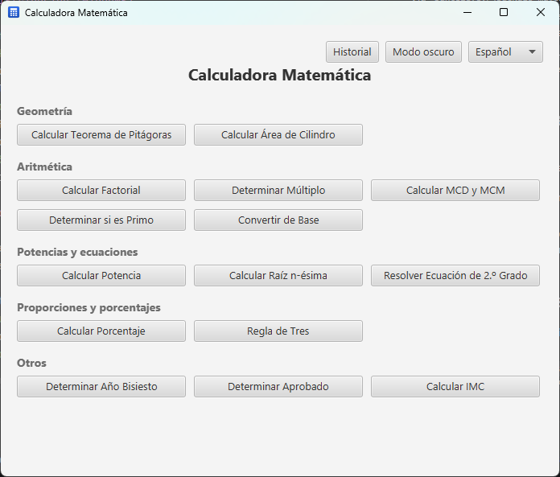
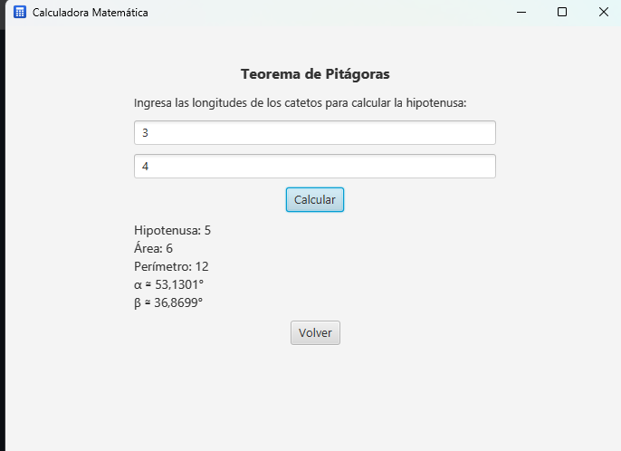

# JavaCalcFX — Calculadora Matemática

[](https://github.com/Guille87/JavaCalcFX/actions/workflows/ci.yml)
[](LICENSE)

Aplicación de escritorio escrita en **Java 17** con **JavaFX 17** que reúne
varias calculadoras matemáticas de uso frecuente tras un menú común. Cada herramienta
valida los datos de entrada, ejecuta el cálculo fuera del hilo de la interfaz
para que la ventana nunca se congele y muestra el resultado (o un mensaje de
error legible) en la misma pantalla.

| Menú | Una calculadora |
|---|---|
|  |  |

---

## Índice

- [Características](#características)
- [Flujo](#flujo)
- [Requisitos](#requisitos)
- [Cómo ejecutar](#cómo-ejecutar)
- [Cómo ejecutar los tests](#cómo-ejecutar-los-tests)
- [Arquitectura](#arquitectura)
- [Estructura del proyecto](#estructura-del-proyecto)
- [Detalles de cada cálculo](#detalles-de-cada-cálculo)
- [Cómo añadir una calculadora nueva](#cómo-añadir-una-calculadora-nueva)
- [Contribución](#contribución)
- [Licencia y contacto](#licencia-y-contacto)

---

## Características

| Calculadora | Entrada | Resultado |
|---|---|---|
| **Teorema de Pitágoras** | Los dos catetos de un triángulo rectángulo (> 0) | Hipotenusa, área, perímetro y los dos ángulos agudos (α, β) en grados |
| **Área de un cilindro** | Radio y altura (≥ 0) | Área total de la superficie: `2·π·r·(r + h)` |
| **Año bisiesto** | Un año del calendario gregoriano (> 0) | Si el año es bisiesto o no |
| **Factorial** | Un entero entre `0` y `100 000` | `n!` con separadores de miles |
| **Múltiplo** | Dos enteros `a` y `b` | Si `a` es múltiplo de `b` |
| **Aprobado** | Cinco notas del alumno entre `0` y `10` | «Aprobado» / «Suspendido» y la nota media (aprueba con media ≥ 5) |
| **Ecuación de 2.º grado** | Los coeficientes `a` (≠ 0), `b` y `c` de `ax² + bx + c = 0` | Las dos raíces (reales, doble o complejas conjugadas), con el discriminante explicado y un **paso a paso** opcional |

Aspectos transversales a todas las pantallas:

- **Validación de dominio**: catetos y radios negativos, años ≤ 0, factoriales
  fuera de rango o divisores no válidos se rechazan con un mensaje claro en vez
  de un `stacktrace` o un resultado silenciosamente incorrecto.
- **Cálculo asíncrono**: cada operación corre en un `Task` sobre un hilo demonio.
  El botón «Calcular» se deshabilita mientras dura, la etiqueta muestra
  «Calculando…» y al navegar a otra pantalla el cálculo en curso se cancela.
- **Teclado**: pulsar <kbd>Enter</kbd> en cualquier campo equivale a pulsar
  «Calcular».
- **Formato numérico legible**: los decimales se muestran con
  `#,##0.####` en lugar de la representación cruda de `double`.
- **Idioma**: español o inglés, seleccionable desde el menú; la elección se
  recuerda para el siguiente arranque.
- **Ventana**: recuerda su tamaño y posición entre sesiones; al abrir un
  formulario el cursor ya está en el primer campo.

---

## Flujo

Menú de calculadoras ⇄ pantalla de formulario (instrucciones · campos · «Calcular» +
resultado · «Volver»). La raíz de la escena es un único contenedor que siempre
muestra **una** pantalla; `mostrar(...)` la intercambia.

---

## Requisitos

- **JDK 17 o superior** (`maven.compiler.release = 17`).
- **Maven 3.8+**. Las dependencias de JavaFX 17 (`org.openjfx`) se descargan desde
  Maven Central; **no hace falta instalar un SDK de JavaFX aparte**.

---

## Cómo ejecutar

```bash
mvn clean javafx:run
```

Depuración (el JVM queda suspendido hasta que un depurador se conecte a
`localhost:8000`):

```bash
mvn clean javafx:run@debug
```

---

## Cómo ejecutar los tests

```bash
mvn clean test
```

Una sola clase o un solo método:

```bash
mvn test -Dtest=FormatoTest
mvn test -Dtest=FormatoTest#numero_entero_sin_decimales
```

Todos los métodos de `CalculadoraTest` viven en una clase `@Nested`
(`TrianguloRectangulo`, `AreaCilindro`, `AnioBisiesto`, `Factorial`, `Multiplos`,
`Notas`), así que para apuntar a uno hay que nombrar la clase que lo contiene:

```bash
mvn test -Dtest='CalculadoraTest$Factorial#rechaza_negativos'
```

El formato del código lo aplica Spotless (`palantir-java-format`). Antes de
commitear:

```bash
mvn spotless:apply
```

La CI ejecuta `mvn spotless:check` y falla si algo no está formateado.

Los tests de interfaz (`InterfazTest`, con TestFX) corren **sin pantalla**
mediante Monocle; no hace falta configurar nada. Para verlos con ventana:

```bash
mvn test -Pheaded -Dtest=InterfazTest
```

---

## Arquitectura

El proyecto se organiza en cuatro paquetes: `calc` (dominio puro), `i18n`
(textos traducibles), `ui` (infraestructura de interfaz reutilizable) y el
paquete raíz (la `Application` y su catálogo de pantallas).

- **`calc/Calculadora.java`** — toda la aritmética como métodos `static` sin
  ninguna dependencia de JavaFX. Cada método comprueba sus precondiciones y, ante
  una entrada inválida, lanza `IllegalArgumentException` con un mensaje apto para
  el usuario. Devuelve `record`s inmutables (`Triangulo`, `EcuacionCuadratica`).
  Es la capa cubierta por tests unitarios.
- **`i18n/`** — `Textos` lee los ficheros `messages*.properties` (español de
  base, inglés encima) y resuelve claves con sustitución de parámetros vía
  `MessageFormat`; `Idioma` es el enum del selector. El idioma se elige desde el
  menú y se recuerda entre sesiones (`java.util.prefs`).
- **`ui/`** — piezas pequeñas con una sola responsabilidad:
  - `Navegador` — contenedor raíz (`StackPane` con un único hijo); `mostrar(Node)`
    intercambia la pantalla y antes ejecuta un *hook* (cancelar el cálculo en curso).
  - `CalculosAsync` — dueño del `ExecutorService` de un hilo demonio y de la
    `Task` actual. `ejecutar(...)` lanza el trabajo fuera del hilo de JavaFX,
    `cancelar()` lo interrumpe y `cerrar()` (desde `Application.stop()`) apaga el
    ejecutor. Solo hay un cálculo a la vez.
  - `ConstructorDeFormularios` — arma la pantalla de formulario genérica (dentro de
    un `ScrollPane`, con el foco en el primer campo).
  - `MensajesDeError` — función pura `Throwable → String` (probada con tests).
  - `Formato` — formateo numérico puro y seguro entre hilos (probado con tests).
  - `Entrada` — único punto de parseo de texto a número (probado con tests).
  - `FiltroNumerico` — `TextFormatter` entero/decimal por campo (probado con tests).
  - `EstadoVentana` — persiste tamaño y posición de la ventana (probado con tests).
  - `PasoAPasoCuadratica` — desarrollo paso a paso de la fórmula cuadrática (probado con tests).
  - `Botones` — fábrica de botones.
- **`SelectorDeOpciones.java`** — `Application` mínima: conecta las piezas de `ui`,
  carga `styles.css` y los iconos, y define un `pantallaX()` + entrada de menú por
  calculadora (cada uno declara título, campos, tipo y función de presentación).

`Calculadora.factorial` consulta `Thread.isInterrupted()` para abortar pronto un
cómputo largo ya cancelado.

Los identificadores y comentarios del código están en **español** (convención
del proyecto); los textos visibles salen de `i18n` (español de base, inglés
incluido).

---

## Estructura del proyecto

```
JavaCalcFX/
├── pom.xml                     Java 17, JavaFX 17.0.13, JUnit 5, TestFX + Monocle, Spotless
├── nbactions.xml               acciones «run» / «debug» para NetBeans
├── LICENSE                     MIT
├── CLAUDE.md · ROADMAP.md      guía para agentes · plan de mejoras
├── docs/                       capturas para el README
├── .github/                    workflow de CI y config de Dependabot
└── src/
    ├── main/
    │   ├── java/
    │   │   ├── module-info.java              requires javafx.controls y java.prefs; exporta los 4 paquetes
    │   │   └── io/guillermoamadodiaz/javacalcfx/
    │   │       ├── SelectorDeOpciones.java       Application + catálogo de pantallas
    │   │       ├── calc/Calculadora.java         lógica matemática pura y validada
    │   │       ├── i18n/                         Textos (lector de .properties) e Idioma
    │   │       └── ui/                           Navegador, CalculosAsync,
    │   │                                         ConstructorDeFormularios, MensajesDeError,
    │   │                                         Formato, Entrada, FiltroNumerico, Botones,
    │   │                                         EstadoVentana
    │   └── resources/io/guillermoamadodiaz/javacalcfx/
    │       ├── styles.css
    │       ├── icons/icon-*.png
    │       └── i18n/messages[_en].properties
    └── test/java/io/guillermoamadodiaz/javacalcfx/
        ├── InterfazTest.java                    TestFX: navegación y mensajes en pantalla
        ├── calc/CalculadoraTest.java            JUnit 5, casos parametrizados y @Nested
        ├── i18n/{Textos,Idioma}Test.java
        └── ui/{Formato,MensajesDeError,Entrada,FiltroNumerico,EstadoVentana,PasoAPasoCuadratica}Test.java
```

---

## Detalles de cada cálculo

**Teorema de Pitágoras.** Usa `Math.hypot` (estable frente a desbordamiento con
catetos grandes) y `Math.atan2` para los ángulos (evita `NaN` cuando un cateto
es 0). Además de la hipotenusa devuelve área, perímetro y los dos ángulos agudos.

**Área de un cilindro.** Devuelve el área **total** (superficie lateral más las
dos bases), `2·π·r·(r + h)`. Admite radio o altura iguales a 0.

**Año bisiesto.** Regla gregoriana proléptica: divisible por 4, salvo los
múltiplos de 100 que no lo sean de 400. Rechaza años ≤ 0.

**Factorial.** La entrada se parsea como `int` y se limita a
`MAX_FACTORIAL = 100 000` para no bloquear la aplicación con un cómputo
desbordado; el resultado es un `BigInteger`. El bucle es interrumpible.

**Múltiplo.** Por convención, `0` es múltiplo de cualquier entero y ningún entero
distinto de `0` es múltiplo de `0`; por eso `esMultiplo(a, 0)` es `true` solo si
`a == 0` y nunca lanza `ArithmeticException`.

**Aprobado.** Media aritmética de las cinco notas; aprueba con media ≥ 5.

---

## Cómo añadir una calculadora nueva

1. Añade un método puro a `Calculadora` con sus precondiciones **y un test**.
2. Añade sus textos (título, instrucciones, campos, resultado y
   `menu.boton.<clave>` + `.tooltip`) a `messages.properties` y
   `messages_en.properties`.
3. Crea un método `pantallaX()` que llame a `formularios.mostrar(...)` con el
   título, las instrucciones, los `prompts`, el `Tipo` de campo y la función de
   presentación (todo vía `Textos.get(...)`).
4. Añade una entrada `botonMenu("<clave>", this::pantallaX)` en `mostrarMenu()`.

---

## Contribución

¡Se aceptan contribuciones! Si encuentras un problema, tienes una sugerencia o
quieres aportar código, abre un *issue* o envía un *pull request*. Antes de
enviarlo, ejecuta `mvn clean test` y mantén la convención de nombres en español.

---

## Licencia y contacto

Publicado bajo la licencia **MIT** (ver [`LICENSE`](LICENSE)).

Para cualquier pregunta o comentario: **guillermo_amado@hotmail.es**.
