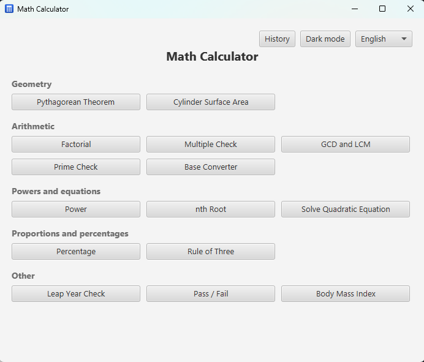
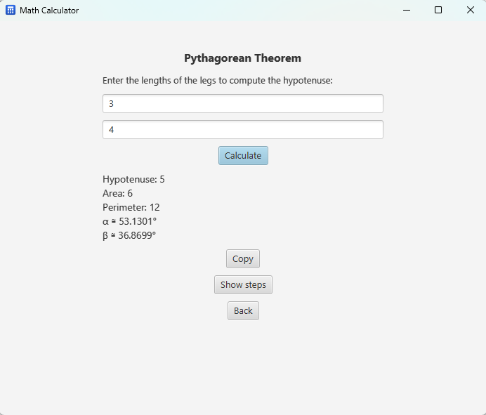

# JavaCalcFX — Math Calculator

<p align="center"><a href="README.md">English</a> · <a href="docs/README_es.md">Español</a></p>

<p align="center">
  <a href="https://github.com/Guille87/JavaCalcFX/actions/workflows/ci.yml"></a>
  <a href="https://github.com/Guille87/JavaCalcFX/actions/workflows/ci.yml"></a>
  <a href="LICENSE"></a>
  <br/>
  <a href="https://github.com/Guille87/JavaCalcFX/graphs/contributors"></a>
  <a href="https://github.com/Guille87/JavaCalcFX/issues"></a>
  <a href="https://github.com/Guille87/JavaCalcFX/pulls"></a>
</p>

A desktop application written in **Java 17** with **JavaFX 21** that gathers
several everyday math calculators behind a common menu. Each tool validates its
input, runs the calculation off the UI thread so the window never freezes, and
shows the result (or a readable error message) on the same screen.

| Menu | A calculator |
|---|---|
|  |  |

---

## Contents

- [Features](#features)
- [Flow](#flow)
- [Download (Windows)](#download-windows)
- [Requirements](#requirements)
- [How to run](#how-to-run)
- [How to package for Windows](#how-to-package-for-windows)
- [How to run the tests](#how-to-run-the-tests)
- [Architecture](#architecture)
- [Project layout](#project-layout)
- [Notes on each calculation](#notes-on-each-calculation)
- [How to add a new calculator](#how-to-add-a-new-calculator)
- [Contributing](#contributing)
- [License and contact](#license-and-contact)

---

## Features

| Calculator | Input | Result |
|---|---|---|
| **Pythagorean Theorem** | The two legs of a right triangle (> 0) | Hypotenuse, area, perimeter and the two acute angles (α, β) in degrees, with optional **step by step** |
| **Cylinder surface area** | Radius and height (≥ 0) | Total surface area: `2·π·r·(r + h)`, with optional **step by step** |
| **Leap year** | A Gregorian calendar year (> 0) | Whether the year is a leap year |
| **Factorial** | An integer between `0` and `100,000` | `n!` with thousands separators |
| **Multiple** | Two integers `a` and `b` | Whether `a` is a multiple of `b` |
| **Pass / fail** | Five student grades between `0` and `10` | «Pass» / «Fail» and the average grade (pass with average ≥ 5) |
| **Quadratic equation** | The coefficients `a` (≠ 0), `b` and `c` of `ax² + bx + c = 0` | The two roots (real, double or complex conjugates), with the discriminant explained and an optional **step by step** |
| **Power** | Base and exponent (any real) | `base^exponent` |
| **nth root** | Radicand and an integer index ≥ 2 | The root; allows odd indices of a negative radicand (`∛-8 = -2`) |
| **GCD and LCM** | Two integers | The greatest common divisor and the least common multiple |
| **Is it prime?** | An integer | Whether it is prime; if composite, a divisor and the factorization |
| **Base converter** | An integer (prefixes `0b`/`0o`/`0x`, or decimal) | The number in binary, octal, decimal and hexadecimal |
| **Percentage** | A percentage and an amount | X% of the amount, with optional **step by step** |
| **Rule of three** | Three values `a`, `b`, `c` | `x = c·b/a` (direct rule of three), with optional **step by step** |
| **BMI** | Weight and height, in metric (kg, cm) or imperial (lb, feet and inches) | The body mass index and its WHO category (underweight / normal / overweight / obesity) |

Cross-cutting concerns across every screen:

- **Domain validation**: negative legs and radii, years ≤ 0, out-of-range
  factorials or invalid divisors are rejected with a clear message instead of a
  stack trace or a silently wrong result.
- **Asynchronous calculation**: every operation runs in a `Task` on a daemon
  thread. The «Calculate» button is disabled while it runs, the label shows
  «Calculating…», and navigating away cancels the in-flight calculation.
- **Keyboard**: pressing <kbd>Enter</kbd> in any field is the same as pressing
  «Calculate»; <kbd>Esc</kbd> goes back to the menu.
- **Copy**: after a calculation, a «Copy» button puts the result on the clipboard.
- **History**: the latest calculations stay on a screen reachable from the menu
  bar; they are remembered between sessions.
- **Readable number formatting**: decimals are shown with `#,##0.####` instead of
  the raw `double` representation.
- **Language**: English or Spanish, selectable from the menu; the choice is
  remembered for the next start.
- **Light or dark theme**: a button in the menu's top bar; the choice is
  remembered between sessions.
- **Window**: remembers its size and position between sessions; when a form
  opens, the cursor is already in the first field.
- **Last screen**: on start it returns to the calculator that was open when the
  app was closed.

---

## Flow

Calculator menu ⇄ form screen (instructions · fields · «Calculate» + result ·
«Back»). The scene root is a single container that always shows **one** screen;
`Navigator.show(...)` swaps it.

---

## Download (Windows)

The [**Releases**](https://github.com/Guille87/JavaCalcFX/releases) page has, for
each version:

- **`JavaCalcFX-X.Y.Z.msi`** — installer. Creates a shortcut and a Start-menu
  entry; installs per user (no administrator rights required).
- **`JavaCalcFX-X.Y.Z-windows-portable.zip`** — a self-contained folder; unzip it
  and run `JavaCalcFX.exe`, nothing to install.

Both bundle their own Java runtime: **no Java installation needed**.

---

## Requirements

Only to build from source (to *use* the app, see the section above):

- **JDK 17 or newer** (`maven.compiler.release = 17`).
- **Maven 3.8+**. The JavaFX 21 LTS dependencies (`org.openjfx`) are downloaded
  from Maven Central; **no separate JavaFX SDK needed**.

---

## How to run

```bash
mvn clean javafx:run
```

Debugging (the JVM stays suspended until a debugger attaches to `localhost:8000`):

```bash
mvn clean javafx:run@debug
```

---

## How to package for Windows

Portable version (folder with `JavaCalcFX.exe` in `target/dist/JavaCalcFX/`):

```bash
mvn -Pdist -DskipTests clean javafx:jlink package
```

`.msi` installer (needs [WiX 3.x](https://github.com/wixtoolset/wix3/releases) on
the `PATH`):

```bash
mvn -Pdist,installer -DskipTests clean javafx:jlink package
```

`javafx:jlink` builds a minimal Java runtime in `target/JavaCalcFX` and `jpackage`
wraps it. On pushing a `vX.Y.Z` tag, the
[`release.yml`](.github/workflows/release.yml) workflow does both on a
`windows-latest` runner and attaches them to the Release.

---

## How to run the tests

```bash
mvn clean test
```

A single class or a single method:

```bash
mvn test -Dtest=FormatTest
mvn test -Dtest=FormatTest#whole_number_without_decimals
```

`CalculatorTest`'s methods live in `@Nested` classes (`RightTriangle`,
`CylinderArea`, `LeapYear`, `Factorial`, `Multiples`, `Grades`, …), so to target
one you name the enclosing class:

```bash
mvn test -Dtest='CalculatorTest$Factorial#rejects_negatives'
```

Code formatting is applied by Spotless (`palantir-java-format`). Before
committing:

```bash
mvn spotless:apply
```

CI runs `mvn spotless:check` (formatting) and `mvn compile spotbugs:check` (static
analysis) and fails on any problem. SpotBugs false positives are listed in
[`spotbugs-exclude.xml`](spotbugs-exclude.xml).

The interface tests (`UiTest`, with TestFX) run **headless** via Monocle; nothing
to set up. To watch them in a window:

```bash
mvn test -Pheaded -Dtest=UiTest
```

`mvn test` also generates the JaCoCo coverage report at
`target/site/jacoco/index.html`. CI publishes the HTML as an artifact, comments
the coverage on every pull request and updates the badge above. Tests run in CI
on **JDK 17 and 21**.

---

## Architecture

The project is organized in four packages: `calc` (pure domain), `i18n`
(translatable text), `ui` (reusable interface infrastructure) and the root
package (the `Application` and its screen catalog).

- **`calc/`** — all the arithmetic as `static` methods, **with no dependency on
  the rest of the project** (nor JavaFX nor the text layer). Each method checks
  its preconditions and, on invalid input, throws `CalculationError` carrying the
  message *key* and its arguments; the interface (`ui/ErrorMessages`) translates
  it. It returns immutable `record`s (`Triangle`, `QuadraticEquation`…).
  `Conversions` turns pounds/feet/inches/centimeters into SI units so the same
  logic is reused (the BMI screen uses it). This is the layer covered by unit
  tests.
- **`i18n/`** — `Messages` reads the `messages*.properties` files (English base,
  Spanish on top) and resolves keys with parameter substitution via
  `MessageFormat`; `Language` is the selector's enum. The language is chosen from
  the menu and remembered between sessions (`java.util.prefs`).
- **`ui/`** — small single-responsibility pieces:
  - `Navigator` — root container (`StackPane` with a single child); `show(Node)`
    swaps the screen and first runs a hook (cancel the in-flight calculation).
  - `AsyncCalculations` — owns the single daemon-thread `ExecutorService` and the
    current `Task`. `run(...)` starts the work off the JavaFX thread, `cancel()`
    interrupts it and `close()` (from `Application.stop()`) shuts the executor
    down. One calculation at a time.
  - `FormBuilder` — builds the generic form screen (inside a `ScrollPane`, focus
    on the first field). After a successful calculation it offers a «Copy» button
    (result to the clipboard), records the calculation in `History` and, if the
    screen supplies it, «Show steps». `showWithModes` is a variant with a
    selector that swaps the fields and the calculation (the BMI screen uses it
    for metric/imperial).
  - `ErrorMessages` — a pure `Throwable → String` function (unit-tested).
  - `Format` — pure, thread-safe number formatting with `Locale.ROOT` (dot
    decimal) so it does not depend on the system language (unit-tested).
  - `Input` — the single text-to-number parsing seam (unit-tested).
  - `NumericFilter` — an integer/decimal `TextFormatter` per field (unit-tested).
  - `WindowState` — persists the window size and position (unit-tested).
  - `Theme` — light/dark mode (`dark-theme` class in `styles.css`), with the
    preference persisted in `java.util.prefs` (unit-tested).
  - `History` — the last 25 calculations (title + result + timestamp), persisted
    in a `java.util.prefs` subnode; the result is trimmed to 300 characters so it
    cannot overflow the preferences size limit, and repeating the same
    calculation only refreshes its timestamp (unit-tested).
  - `LastCalculator` — stores in `java.util.prefs` the key of the last calculator
    opened; `CalculatorApp` reopens it on start and forgets it on going back to
    the menu (unit-tested).
  - `XSteps` — step-by-step explanation, in linear notation, of the quadratic,
    Pythagoras, the cylinder, the percentage and the rule of three (deterministic
    templates, unit-tested).
  - `Buttons` — a button factory.
- **`CalculatorApp.java`** — a minimal `Application`: wires the `ui` pieces
  together, loads `styles.css` and the icons, and defines one `xScreen()` + one
  menu entry per calculator (each declares title, fields, type and presentation
  function).

`Calculator.factorial` checks `Thread.isInterrupted()` to abort a long, already
cancelled computation early.

Identifiers and comments in the code are in **English**; user-visible text comes
from `i18n` (English base, Spanish included).

---

## Project layout

```
JavaCalcFX/
├── pom.xml                     Java 17, JavaFX 21 LTS, JUnit 5, TestFX + Monocle, JaCoCo, Spotless, SpotBugs
├── spotbugs-exclude.xml        SpotBugs false positives
├── nbactions.xml               «run» / «debug» actions for NetBeans
├── LICENSE                     MIT
├── CLAUDE.md                   guide for agents
├── README.md · CONTRIBUTING.md · CHANGELOG.md · ROADMAP.md   English (primary)
├── CODE_OF_CONDUCT.md · SECURITY.md   community health files
├── docs/                       *_es.md (Spanish docs) and README screenshots
├── .github/                    CI and release workflows, badges, Dependabot and issue templates
└── src/
    ├── main/
    │   ├── java/
    │   │   ├── module-info.java              requires javafx.controls and java.prefs; exports the 4 packages
    │   │   └── io/guillermoamadodiaz/javacalcfx/
    │   │       ├── CalculatorApp.java           Application + screen catalog
    │   │       ├── calc/Calculator.java         pure, validated math logic
    │   │       ├── i18n/                        Messages (.properties reader) and Language
    │   │       └── ui/                          Navigator, AsyncCalculations, FormBuilder,
    │   │                                        ErrorMessages, Format, Input, NumericFilter,
    │   │                                        Buttons, WindowState, Theme, History, LastCalculator
    │   └── resources/io/guillermoamadodiaz/javacalcfx/
    │       ├── styles.css
    │       ├── icons/icon-*.png · icon.ico   (the .ico is used by jpackage)
    │       └── i18n/messages[_es].properties
    └── test/java/io/guillermoamadodiaz/javacalcfx/
        ├── UiTest.java                         TestFX: navigation and on-screen messages
        ├── calc/CalculatorTest.java            JUnit 5, parametrized cases and @Nested
        ├── i18n/{Messages,Language}Test.java
        └── ui/{Format,ErrorMessages,Input,NumericFilter,WindowState,Theme,History,
             LastCalculator,{Cylinder,Quadratic,Pythagoras,Proportions}Steps}Test.java
```

---

## Notes on each calculation

**Pythagorean Theorem.** Uses `Math.hypot` (overflow-stable with large legs) and
`Math.atan2` for the angles (avoids `NaN` when a leg is 0). Besides the
hypotenuse it returns area, perimeter and the two acute angles.

**Cylinder surface area.** Returns the **total** area (lateral surface plus the
two bases), `2·π·r·(r + h)`. Allows a radius or height equal to 0.

**Leap year.** Proleptic Gregorian rule: divisible by 4, except multiples of 100
that are not multiples of 400. Rejects years ≤ 0.

**Factorial.** The input is parsed as an `int` and capped at
`MAX_FACTORIAL = 100,000` so an overflowing computation cannot block the app; the
result is a `BigInteger`. The loop is interruptible.

**Multiple.** By convention, `0` is a multiple of every integer and no non-zero
integer is a multiple of `0`; so `isMultiple(a, 0)` is `true` only if `a == 0`
and never throws `ArithmeticException`.

**Pass / fail.** Arithmetic mean of the five grades; pass with average ≥ 5.

---

## How to add a new calculator

1. Add a pure method to `Calculator` with its preconditions (throws
   `CalculationError` with a key on invalid input) **and a test**.
2. Add its text (title, instructions, fields, result, `menu.button.<key>` +
   `.tooltip` and the error keys) to `messages.properties` and
   `messages_es.properties`.
3. Create an `xScreen()` method that calls `forms.show(...)` with the title, the
   instructions, the `prompts`, the field `Type` and the presentation function
   (all via `Messages.get(...)`); optionally, a `steps` function.
4. Add a `MenuEntry("<key>", this::xScreen)` in the right `Category` of
   `catalog()`. If it helps, add a pure `ui/XSteps` and pass it as the `steps`
   argument.

---

## Contributing

Contributions are welcome! Open an issue or send a pull request. The conventions
(formatting, text, commit messages, how to add a calculator, how to release) are
in [`CONTRIBUTING.md`](CONTRIBUTING.md); the changes in each version, in
[`CHANGELOG.md`](CHANGELOG.md).

---

## License and contact

Released under the **MIT** license (see [`LICENSE`](LICENSE)).

For any question or comment: **guillermo_amado@hotmail.es**.
